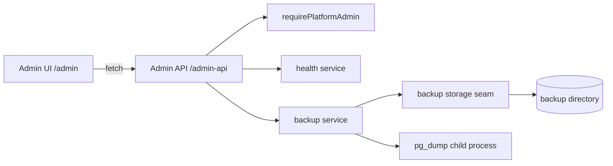

# Admin Console

Операційна консоль Role Engine: огляд стану, health-перевірки та резервні копії БД. Це частина того самого modular monolith, але з окремими route namespace, окремим authorization boundary і storage-абстракцією, щоб у майбутньому винести її на інший domain/контейнер без переписування.

## Межі

```
/admin/*        Admin UI (окремий frontend namespace, не публічний)
/admin-api/*    Admin API (окремий backend namespace, не публічний)
```

Публічний продукт (`/`, `/api/*`) не змінюється: `/admin-api` не перетинається з `/api`, тому наявна публічна маршрутизація не відкриває консоль автоматично.

Business logic живе в `src/server/admin/*`, HTTP-адаптери — у `src/app/admin-api/*`, UI — у `src/app/admin/*` + `src/components/admin/*`. UI звертається лише до `/admin-api` (base налаштовується через `NEXT_PUBLIC_ADMIN_API_BASE`), тому frontend не є security boundary і не залежить від внутрішніх server-модулів.



## Доступ

Платформної ролі на кшталт `admin`/`moderator` у проєкті немає: `User.role` видалено, а `WorkspaceMembership(role=OWNER|GM|PLAYER)` описує продуктовий доступ у конкретному workspace і не повинна давати ops-доступ. Тому permission консолі — це allowlist існуючих акаунтів:

```
ADMIN_ACCOUNTS="admin@example.com,<user-cuid>"
```

* порівняння регістронезалежне, приймає email або account id (session не містить username);
* порожній allowlist = fail closed: консоль недоступна нікому;
* перевірка виконується на сервері в `requirePlatformAdmin()`, UI лише показує посилання в навігації;
* жодної другої системи користувачів і жодних змін Prisma schema не додано. Якщо згодом знадобиться DB-прапорець (`User.isPlatformAdmin`), його достатньо підключити в одному файлі `src/server/admin/authz.ts`.

HTTP-відповіді: без сесії — `401 UNAUTHORIZED`, звичайний користувач — `403 FORBIDDEN` (JSON envelope з `src/server/errors.ts`), non-admin сторінка `/admin` віддає `404`, щоб не розкривати існування консолі.

## Мережевий доступ (LAN-only)

У цьому репозиторії немає Docker Compose, Traefik або Cloudflare-конфігурації: наявна інфраструктура (`Cloudflare Tunnel → Traefik → Role Engine`) живе поза workspace. Тому network restriction реалізується на рівні наявного proxy/tunnel, а не в бізнес-логіці.

**Застосувати на існуючій інфраструктурі (не автоматизовано цим репозиторієм):**

1. `cloudflared` ingress має маршрутизувати лише `/` і `/api/*`. Catch-all `- service: http://traefik:80` без path-умови небезпечний — він відкриє `/admin*` у Internet. Якщо catch-all існує, додати перед ним явну відмову:

```yaml
ingress:
  - hostname: roleengine.ddns.org
    path: ^/api/
    service: http://traefik:80
  - hostname: roleengine.ddns.org
    path: ^/admin(-api)?/
    service: http_status:404     # Admin ніколи не публікується
  - hostname: roleengine.ddns.org
    service: http://traefik:80
```

2. Admin router у Traefik прив'язати до LAN entrypoint/мережі та `ipAllowList` (приклад динамічної конфігурації, застосовується оператором):

```yaml
http:
  routers:
    role-engine-admin:
      entryPoints: [lan]                       # окремий LAN entrypoint, не websecure з tunnel
      rule: Host(`roleengine.ddns.org`) && (PathPrefix(`/admin`) || PathPrefix(`/admin-api`))
      middlewares: [admin-lan-only]
      service: role-engine
    role-engine-public:
      entryPoints: [websecure]
      rule: Host(`roleengine.ddns.org`) && (Path(`/`) || PathPrefix(`/api`))
      service: role-engine
  middlewares:
    admin-lan-only:
      ipAllowList:
        sourceRange: ["127.0.0.1/32", "192.168.0.0/16", "10.0.0.0/8"]
```

3. Публічний tunnel не змінюється: admin routes просто не мають публічного router'а.

**Опційний app-level guard (defense-in-depth):** `ADMIN_ALLOWED_IP_RANGES` (`10.0.0.0/8,192.168.0.0/16,127.0.0.1/32,::1`) + `ADMIN_IP_HEADER` (за замовчуванням `x-forwarded-for`) дозволяють застосунку самому відхиляти запити поза LAN. Якщо змінна не задана, guard неактивний і єдиною мережевою межею залишається proxy — саме тому ці змінні не замінюють кроки 1–2. Guard fail closed: невідома адреса клієнта, непідтримуваний формат (наприклад IPv6 CIDR) або адреса поза списком дають `403 ADMIN_NETWORK_RESTRICTED`. Заголовок довіряється лише тому, що застосунок не доступний напряму з Internet.

## Безпека: огляд меж

* **Auth**: сесія Auth.js (JWT cookie). Backend перевіряє її в кожному admin handler-і та page; UI не є межею.
* **Authorization**: єдина функція `requirePlatformAdmin()` (session + allowlist). Workspace membership не дає ops-доступу.
* **IDOR / arbitrary files**: клієнт передає лише `backupId`, який має відповідати `^[a-z0-9][a-z0-9-]{7,79}$`; storage додатково перевіряє ім'я файлу та те, що resolved path лежить усередині storage root. Download/delete працюють лише з `<id>.dump` і `<id>.json`.
* **Command execution**: єдина зовнішня команда — `pg_dump` через `spawn` без shell; аргументи фіксовані, `--file` вказує на server-generated шлях у storage, `schema` приймається лише як plain identifier, password передається через env.
* **SQL**: єдиний raw query — статичний `SELECT` із `_prisma_migrations` без інтерполяції input.
* **CSRF**: cookie сесії `SameSite=Lax`, тому cross-site POST/DELETE не надсилає сесію; admin API відповідає лише same-origin запитам UI (крос-доменний доступ потребуватиме явного CORS, якого зараз немає). Restore навіть за наявності сесії вимагає confirmation token у тілі.
* **Public static**: dump-файли лежать у `ADMIN_BACKUP_DIR` поза `public/`, не роздаються статично і не комітяться (`backups` у `.gitignore`).
* **Помилки**: повідомлення pg_dump/DB проходять через `redactSecrets` (пароль зникає), тому в UI і manifest не потрапляють credentials.

## Backups

```
Admin UI → Admin API → backup service → backup storage (local dir) → pg_dump → PostgreSQL
```

* dump створюється `pg_dump --format=custom --no-owner --no-privileges` у файл `<id>.dump.part`, і лише після успішного exit code перейменовується на `<id>.dump` — частковий файл ніколи не виглядає як валідний backup;
* `<id>.json` — sidecar manifest: `id`, `fileName`, `createdAt`, `sizeBytes`, `status`, `appVersion`, `appCommit`, `schemaMigration` (останній застосований migration name із `_prisma_migrations`), `createdById`, `message` (лише для failure-ів, з відредагованими секретами);
* DB-моделі для метаданих немає навмисно: джерелом істини є сам storage, тому немає dual-write drift; dump-файли ніколи не зберігаються в PostgreSQL;
* `id` генерується застосунком (`backup-<UTC stamp>-<8 hex>`), а client-provided `backupId` проходить перевірку формату на HTTP-межі та повторно в storage (`resolvePath`) — довільні шляхи на кшталт `../../etc/passwd` відхиляються `400`;
* credentials не потрапляють в argv: host/port/user/db передаються аргументами, password — через `PGPASSWORD` у env дочірнього процесу; shell не використовується (`spawn` без `shell`);
* create/delete пишуть `AuditLog` з `entityType=AdminBackup`;
* download — `GET`, віддає stream із `Content-Disposition: attachment`, `Cache-Control: no-store` та `X-Content-Type-Options: nosniff`;
* restore **реалізовано** (`POST /admin-api/backups/{id}/restore`, body `{ "confirm": "RESTORE" }`): перед виконанням архів перевіряється `pg_restore --list` (відхиляється, якщо dump не читається або не містить Role Engine schema); безпосередньо перед відновленням створюється **safety backup** з ідентифікатором `backup-safety-<UTC stamp>-<8 hex>`; під час самого `pg_restore` працює **write barrier** (`DATABASE_MAINTENANCE` — усі невалідні для читання Prisma-запити в цьому процесі відхиляються `503`), connection pool закривається і відновлюється ледаче; після завершення БД перевіряється на наявність Role Engine schema, а результат містить `safetyBackup`, `previousSchemaMigration`/`restoredSchemaMigration` та `schemaChanged`; усі три фази (started/completed/failed) пишуть `AuditLog` з `entityType=AdminBackupRestore`;
* **конкурентність**: одночасний другий restore відхиляється `409 RESTORE_IN_PROGRESS`; звичайний create/delete backup під час restore також відхиляється `409 RESTORE_IN_PROGRESS` (safety backup, який створює сам restore, — виняток). Обмеження: barrier і lock — process-local, тобто не захищають від іншого інстансу застосунку;
* **обмеження**: restore замінює всю БД, включно з `_prisma_migrations` — якщо dump зроблено з іншою версією schema, застосунок може потребувати `prisma migrate deploy` після відновлення (ознака — `schemaChanged: true` у відповіді).
* якщо dump-файл зник, але manifest лишився, запис показується як `FAILED` (`STORAGE_FILE_MISSING`), а не як успішний; dump-файли без manifest також потрапляють у список.

Storage seam (`src/server/admin/backup-storage.ts`) дозволяє замінити local filesystem на MinIO/S3 без змін API та UI.

## Ендпоінти

| Метод | Шлях | Призначення |
| --- | --- | --- |
| GET | `/admin-api/overview` | health + backup summary для dashboard |
| GET | `/admin-api/health` | детальний health snapshot |
| GET | `/admin-api/backups` | список backups (метадані + факти зі storage) |
| POST | `/admin-api/backups` | створити backup |
| DELETE | `/admin-api/backups/{backupId}` | видалити dump і manifest |
| GET | `/admin-api/backups/{backupId}/download` | завантажити dump |
| POST | `/admin-api/backups/{backupId}/restore` | відновити БД з dump-у (requires `{ "confirm": "RESTORE" }`) |

Помилки повертаються як `{ "error": "CODE", "message": "...", "details"?: ... }`; успішні відповіді мають `Cache-Control: no-store`.

## UI

`/admin` (Dashboard: System + Backup), `/admin/backups` (list/create/download/delete з confirmation, loading і локалізованими помилками), `/admin/health` (детальні перевірки), а також `/admin/metrics`, `/admin/logs`, `/admin/database` — явні placeholders без вигаданих значень. Значення, які backend не може безпечно виміряти (наприклад load average на Windows, відсутній disk stat), показуються як "Not available".

## Конфігурація

| Змінна | Призначення |
| --- | --- |
| `ADMIN_ACCOUNTS` | email/id адміністраторів консолі (обов'язково для доступу) |
| `ADMIN_BACKUP_DIR` | директорія backups (default `<cwd>/backups`) |
| `ADMIN_PG_DUMP_PATH` | шлях до `pg_dump` (default `pg_dump` з PATH) |
| `ADMIN_ALLOWED_IP_RANGES` | опційний LAN allowlist (IPv4/CIDR + точні IPv6 літерали) |
| `ADMIN_IP_HEADER` | заголовок із client IP (default `x-forwarded-for`) |
| `APP_VERSION`, `APP_COMMIT` | опційні метадані застосунку для dashboard і manifest |
| `NEXT_PUBLIC_ADMIN_API_BASE` | base path/URL admin API для UI (default `/admin-api`) |

## Перевірка

```bash
npx tsx --test "src/server/admin/**/*.test.ts" "src/app/admin-api/**/*.test.ts"

# реальний pg_dump проти налаштованої БД (потрібні DATABASE_URL, ADMIN_PG_DUMP_PATH)
npx tsx scripts/admin-backup-check.ts

# E2E: перші два сценарії працюють завжди, третій — лише коли ADMIN_ACCOUNTS містить gm@role.local
npx playwright test tests/e2e/admin-console.spec.ts
```

## Майбутнє винесення

* UI вже не імпортує server-модулів і знає лише `NEXT_PUBLIC_ADMIN_API_BASE`;
* admin API — окремий namespace з тонкими адаптерами над `src/server/admin/*`;
* мережеві обмеження живуть у proxy, тому їх можна перенести на `admin.<domain>` без змін у коді;
* backup logic, authorization, health checks і logging integration не потрібно переписувати, бо вони вже ізольовані всередині `src/server/admin`.

## Поза скоупом

Metrics, structured logs, readiness/liveness та DB-інспекція залишаються невиконаною частиною ROADMAP; консоль не має їх імітувати. Restore тепер реалізований, але лише для локального filesystem storage та при запущеному `pg_restore` в PATH (або через `PG_RESTORE_PATH`); restore виконується sync у межах одного HTTP-запиту.