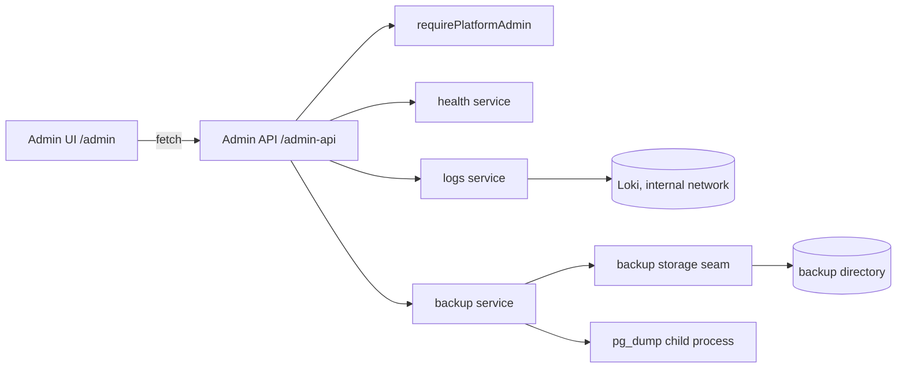

# Admin Console

Операційна консоль Role Engine: огляд стану, health-перевірки, логи та резервні копії БД. Це частина того самого modular monolith, але з окремими route namespace, окремим authorization boundary і storage-абстракціями, щоб у майбутньому винести її на інший domain/контейнер без переписування.

## Межі

```
/admin/*        Admin UI (окремий frontend namespace, не публічний)
/admin-api/*    Admin API (окремий backend namespace, не публічний)
```

Публічний продукт (`/`, `/api/*`) працює як раніше, а admin paths публікуються свідомо окремими path-правилами (див. «Мережевий доступ»). `/admin-api` не перетинається з `/api`, тому випадкової публікації через продуктове правило `/api/*` не буває — потрібен явний маршрут.

Business logic живе в `src/server/admin/*`, HTTP-адаптери — у `src/app/admin-api/*`, UI — у `src/app/admin/*` + `src/components/admin/*`. UI звертається лише до `/admin-api` (base налаштовується через `NEXT_PUBLIC_ADMIN_API_BASE`), тому frontend не є security boundary і не залежить від внутрішніх server-модулів.



## Доступ

Платформної ролі на кшталт `admin`/`moderator` у проєкті немає: `User.role` видалено, а `WorkspaceMembership(role=OWNER|GM|PLAYER)` описує продуктовий доступ у конкретному workspace і не повинна давати ops-доступ. Тому permission консолі — це allowlist існуючих акаунтів:

```
ADMIN_ACCOUNTS="admin@example.com,<user-cuid>"
```

* порівняння регістронезалежне, приймає email або account id (session не містить username);
* порожній allowlist = fail closed: консоль недоступна нікому;
* перевірка виконується на сервері в `requirePlatformAdmin()`, UI лише показує посилання в навігації;
* жодної другої системи користувачів і жодних змін Prisma schema не додано. Якщо згодом знадобиться DB-прапорець (`User.isPlatformAdmin`), його достатньо підключити в одному файлі `src/server/admin/authz.ts`.

HTTP-відповіді: без сесії — `401 UNAUTHORIZED`, звичайний користувач — `403 FORBIDDEN` (JSON envelope з `src/server/errors.ts`), non-admin сторінка `/admin` віддає `404`, щоб не розкривати існування консолі.

## Мережевий доступ (LAN + Internet)

Консоль підтримує обидва режими: роботу з локальної мережі та доступ з Internet через наявний proxy/tunnel. У репозиторії немає Docker Compose, Traefik або Cloudflare-конфігурації — маршрутизацію виконує інфраструктура оператора, а застосунок додає власні перевірки (authorization, origin guard для мутацій, опційний IP allowlist).

### Режим A (підтримуваний): Internet через існуючий Cloudflare Tunnel

`/admin` і `/admin-api` публікуються тими самими path-правилами, що й продукт. Приклад `cloudflared` ingress:

```yaml
ingress:
  - hostname: roleengine.ddns.org
    path: ^/(api|admin-api|admin)(/|$)
    service: http://traefik:80
  - hostname: roleengine.ddns.org
    service: http://traefik:80
```

Traefik: admin paths ідуть через той самий entrypoint, який бачить tunnel, з hardening і rate limit:

```yaml
http:
  routers:
    role-engine-admin:
      entryPoints: [websecure]          # назва залежить від вашої конфігурації
      rule: Host(`roleengine.ddns.org`) && (PathPrefix(`/admin`) || PathPrefix(`/admin-api`))
      middlewares: [admin-hardening, admin-rate-limit]
      service: role-engine
  middlewares:
    admin-hardening:
      headers:
        stsSeconds: 31536000
        contentTypeNosniff: true
        frameDeny: true
        referrerPolicy: no-referrer
    admin-rate-limit:
      rateLimit:
        average: 30
        burst: 60
        period: 1m
```

Публікація консолі допустима лише разом із цим мінімумом:

1. **HTTPS only.** TLS термінується на Cloudflare/Traefik, `AUTH_TRUST_HOST=true`, сесійні cookie стають `Secure`. Прямий HTTP-доступ до консолі не відкривати.
2. **`ADMIN_ALLOWED_IP_RANGES` має лишатися порожнім** — інакше app-level guard заблокує публічні запити (`403 ADMIN_NETWORK_RESTRICTED`).
3. **`ADMIN_ACCOUNTS` — окремі ops-акаунти.** Не використовувати ігрові/демо-акаунти з коротким паролем; 2FA у застосунку немає.
4. **Rate limiting на proxy** для `/admin*` і `/api/auth/*`: вбудований lockout у застосунку process-local і не захищає між інстансами.
5. **Усвідомити наслідки:** авторизований адміністратор завантажує повний dump БД, а restore перезаписує поточну БД цілком.
6. За потреби сильнішої межі ніж пароль — Cloudflare Access / mTLS перед консоллю; app-level authorization залишається обов'язковою в будь-якому разі.

### Режим B (опційний): LAN-only

Якщо консоль має бути недоступною з Internet, admin router прив'язується до LAN entrypoint і `ipAllowList`, а публічний ingress явно відмовляє для admin paths:

```yaml
# cloudflared: перед catch-all, якщо він існує
  - hostname: roleengine.ddns.org
    path: ^/admin(-api)?/
    service: http_status:404

# traefik
http:
  routers:
    role-engine-admin:
      entryPoints: [lan]
      rule: Host(`roleengine.ddns.org`) && (PathPrefix(`/admin`) || PathPrefix(`/admin-api`))
      middlewares: [admin-lan-only]
      service: role-engine
  middlewares:
    admin-lan-only:
      ipAllowList:
        sourceRange: ["127.0.0.1/32", "192.168.0.0/16", "10.0.0.0/8"]
```

### App-level guard (defense-in-depth)

`ADMIN_ALLOWED_IP_RANGES` (`10.0.0.0/8,192.168.0.0/16,127.0.0.1/32,::1`) + `ADMIN_IP_HEADER` (default `x-forwarded-for`) змушують застосунок самому відхиляти запити поза списком. Guard недоступний, якщо змінна порожня (тоді межа — proxy). Guard fail closed: невідома адреса клієнта, непідтримуваний формат (наприклад IPv6 CIDR) або адреса поза списком дають `403 ADMIN_NETWORK_RESTRICTED`. Для публічного режиму (A) змінну треба залишити порожньою; для LAN-only (B) вона є другою межею після proxy.

## Безпека: огляд меж

* **Auth**: сесія Auth.js (JWT cookie). Backend перевіряє її в кожному admin handler-і та page; UI не є межею.
* **Authorization**: єдина функція `requirePlatformAdmin()` (session + allowlist). Workspace membership не дає ops-доступу.
* **IDOR / arbitrary files**: клієнт передає лише `backupId`, який має відповідати `^[a-z0-9][a-z0-9-]{7,79}$`; storage додатково перевіряє ім'я файлу та те, що resolved path лежить усередині storage root. Download/delete працюють лише з `<id>.dump` і `<id>.json`.
* **Command execution**: єдина зовнішня команда — `pg_dump` через `spawn` без shell; аргументи фіксовані, `--file` вказує на server-generated шлях у storage, `schema` приймається лише як plain identifier, password передається через env.
* **SQL**: єдиний raw query — статичний `SELECT` із `_prisma_migrations` без інтерполяції input.
* **CSRF / cross-site**: усі admin-мутації (`POST`, `DELETE`) проходять `assertAdminMutationOrigin()`: запит із чужим `Origin` або `Sec-Fetch-Site: cross-site` відхиляється `403 ADMIN_ORIGIN_NOT_ALLOWED`. Порівнюється хост (не схема), бо TLS термінується на proxy; non-browser клієнти без цих заголовків допускаються лише з валідною admin-сесією. Restore додатково вимагає confirmation token у тілі.
* **Headers / індексація**: `next.config.ts` додає `X-Frame-Options: DENY`, `X-Content-Type-Options: nosniff`, `Referrer-Policy: no-referrer`, `X-Robots-Tag: noindex, nofollow` на `/admin*` і `/admin-api*`; `robots.txt` (`src/app/robots.ts`) закриває ті самі шляхи для краулерів.
* **Residual ризики публічного режиму**: brute-force пароля admin-акаунта (вбудований lockout лише process-local), відсутність 2FA, будь-який адміністратор може завантажити повний dump БД, restore стирає поточні дані. Для зменшення — окремі ops-акаунти, rate limiting на proxy, Cloudflare Access/mTLS за потреби.
* **Public static**: dump-файли лежать у `ADMIN_BACKUP_DIR` поза `public/`, не роздаються статично і не комітяться (`backups` та `.PG_backups` у `.gitignore`).
* **Помилки**: повідомлення pg_dump/DB проходять через `redactSecrets` (пароль зникає), тому в UI і manifest не потрапляють credentials.

## Backups

```
Admin UI → Admin API → backup service → backup storage (local dir) → pg_dump → PostgreSQL
```

* dump створюється `pg_dump --format=custom --no-owner --no-privileges` у файл `<id>.dump.part`, і лише після успішного exit code перейменовується на `<id>.dump` — частковий файл ніколи не виглядає як валідний backup;
* `<id>.json` — sidecar manifest: `id`, `fileName`, `createdAt`, `sizeBytes`, `status`, `appVersion`, `appCommit`, `schemaMigration` (останній застосований migration name із `_prisma_migrations`), `createdById`, `message` (лише для failure-ів, з відредагованими секретами);
* DB-моделі для метаданих немає навмисно: джерелом істини є сам storage, тому немає dual-write drift; dump-файли ніколи не зберігаються в PostgreSQL;
* `id` генерується застосунком (`backup-<UTC stamp>-<8 hex>`), а client-provided `backupId` проходить перевірку формату на HTTP-межі та повторно в storage (`resolvePath`) — довільні шляхи на кшталт `../../etc/passwd` відхиляються `400`;
* credentials не потрапляють в argv: host/port/user/db передаються аргументами, password — через `PGPASSWORD` у env дочірнього процесу; shell не використовується (`spawn` без `shell`);
* create/delete пишуть `AuditLog` з `entityType=AdminBackup`;
* download — `GET`, віддає stream із `Content-Disposition: attachment`, `Cache-Control: no-store` та `X-Content-Type-Options: nosniff`;
* restore **реалізовано** (`POST /admin-api/backups/{id}/restore`, body `{ "confirm": "RESTORE" }`): перед виконанням архів перевіряється `pg_restore --list` (відхиляється, якщо dump не читається або не містить Role Engine schema); безпосередньо перед відновленням створюється **safety backup** з ідентифікатором `backup-safety-<UTC stamp>-<8 hex>`; під час самого `pg_restore` працює **write barrier** (`DATABASE_MAINTENANCE` — усі невалідні для читання Prisma-запити в цьому процесі відхиляються `503`), connection pool закривається і відновлюється ледаче; після завершення БД перевіряється на наявність Role Engine schema, а результат містить `safetyBackup`, `previousSchemaMigration`/`restoredSchemaMigration` та `schemaChanged`; усі три фази (started/completed/failed) пишуть `AuditLog` з `entityType=AdminBackupRestore`;
* **конкурентність**: одночасний другий restore відхиляється `409 RESTORE_IN_PROGRESS`; звичайний create/delete backup під час restore також відхиляється `409 RESTORE_IN_PROGRESS` (safety backup, який створює сам restore, — виняток). Обмеження: barrier і lock — process-local, тобто не захищають від іншого інстансу застосунку;
* **обмеження**: restore замінює всю БД, включно з `_prisma_migrations` — якщо dump зроблено з іншою версією schema, застосунок може потребувати `prisma migrate deploy` після відновлення (ознака — `schemaChanged: true` у відповіді).
* якщо dump-файл зник, але manifest лишився, запис показується як `FAILED` (`STORAGE_FILE_MISSING`), а не як успішний; dump-файли без manifest також потрапляють у список.

Storage seam (`src/server/admin/backup-storage.ts`) дозволяє замінити local filesystem на MinIO/S3 без змін API та UI.

### Автоматичні backups

`npm run backup:worker` запускає окремий довгоживучий процес, який використовує той самий backup service і `pg_dump`, що й Admin Console. Він перевіряє `AuditLog` раз на хвилину: якщо за останні 10 хвилин була продуктова зміна персонажа, вузла, шаблону, ефекту, слота/тега шаблону або призначення, створює backup не частіше ніж раз на 5 хвилин. Щодня о 06:00 за локальним часовим поясом процес створює окремий контрольний backup незалежно від активності. Параметри задаються змінними нижче; інтервал частих копій можна виставити 10 хвилин.

Worker кожен цикл видаляє завершені backups старше 7 днів разом із manifest-файлами. Safety backups із `backup-safety-` retention не видаляє. Статус розкладу зберігається в `.automation-state.json` у backup directory, тому саму директорію треба монтувати на постійний volume. AuditLog має зберігатися в БД; якщо його очищати, контроль активності бачить лише доступні записи.

Worker не запускається автоматично всередині Next.js web process: у production запускайте його як окремий сервіс/контейнер, щоб web replicas не створювали дубльовані копії. Приклад змінних та Docker Compose service наведено в `docs/AUTOMATED_BACKUPS_UBUNTU.md`. Поточний репозиторій не містить Dockerfile/Compose, тому сервіс треба додати до наявної deployment-конфігурації, використовуючи той самий image, мережу, env-файл і backup volume, що й застосунок.

## Ендпоінти

| Метод | Шлях | Призначення |
| --- | --- | --- |
| GET | `/admin-api/overview` | health + backup summary для dashboard |
| GET | `/admin-api/health` | детальний health snapshot |
| GET | `/admin-api/backups` | список backups (метадані + факти зі storage) |
| POST | `/admin-api/backups` | створити backup |
| DELETE | `/admin-api/backups/{backupId}` | видалити dump і manifest |
| GET | `/admin-api/backups/{backupId}/download` | завантажити dump |
| POST | `/admin-api/backups/{backupId}/restore` | відновити БД з dump-у (requires `{ "confirm": "RESTORE" }`) |

Помилки повертаються як `{ "error": "CODE", "message": "...", "details"?: ... }`; успішні відповіді мають `Cache-Control: no-store`. `POST` і `DELETE` вимагають same-origin запиту (див. «Безпека»); `GET /admin-api/backups/{backupId}/download` лишається звичайним GET-стримом.

## UI

`/admin` (Dashboard: System + Backup), `/admin/backups` (list/create/download/delete з confirmation, loading і локалізованими помилками), `/admin/health` (детальні перевірки), `/admin/logs` (останні логи застосунку та backup worker-а через Loki), а також `/admin/metrics` і `/admin/database` (placeholders). Значення, які backend не може безпечно виміряти (наприклад load average на Windows, відсутній disk stat), показуються як "Not available".

## Логи

Застосунок виводить структуровані JSON-події в stdout/stderr: необроблені помилки запитів Next.js, API-помилки 5xx, створення/помилки бекапів і роботу backup worker-а. Поля з назвами `password`, `secret`, `token`, `authorization`, `cookie`, `database_url` і `connection_string` редагуються logger-ом; повідомлення та stack trace необроблених помилок не записуються. `AuditLog` лишається окремою історією продуктових змін.

`GET /admin-api/logs` вимагає `requirePlatformAdmin()`, приймає лише фіксовані періоди `15m`, `1h`, `6h`, `24h` та джерела `app`, `worker`, `all`, обмежує відповідь 200 записами та робить запит до `ADMIN_LOKI_URL` лише на сервері. Browser не отримує адресу Loki. Loki не має власної авторизації в цій single-node конфігурації, тому його HTTP-порт не публікується назовні та доступний лише через внутрішню Docker-мережу; захищений проксі до нього — `/admin-api/logs`.

Для Ubuntu приклади Loki/Alloy конфігурації та Compose інтеграції — у `docs/OBSERVABILITY_UBUNTU.md`. Alloy читає Docker logs через Docker API, тому має чутливий доступ до Docker daemon socket; не монтувати socket у Role Engine web/worker контейнери й не відкривати його через мережу. Для обмеження локального розміру Docker logs увімкнути logging driver `local` або явну ротацію.

## Конфігурація

| Змінна | Призначення |
| --- | --- |
| `ADMIN_ACCOUNTS` | email/id адміністраторів консолі (обов'язково для доступу) |
| `ADMIN_BACKUP_DIR` | директорія backups (default `<cwd>/backups`) |
| `ADMIN_PG_DUMP_PATH` | шлях до `pg_dump` (default `pg_dump` з PATH) |
| `ADMIN_PG_RESTORE_PATH` | шлях до `pg_restore` (default: sibling налаштованого `pg_dump`, інакше PATH) |
| `ADMIN_ALLOWED_IP_RANGES` | опційний IP allowlist; для публічного доступу лишити порожнім |
| `ADMIN_IP_HEADER` | заголовок із client IP (default `x-forwarded-for`) |
| `ADMIN_LOKI_URL` | внутрішня base URL Loki (наприклад `http://loki:3100`); потрібна для вкладки логів |
| `APP_VERSION`, `APP_COMMIT` | опційні метадані застосунку для dashboard і manifest |
| `NEXT_PUBLIC_ADMIN_API_BASE` | base path/URL admin API для UI (default `/admin-api`) |
| `BACKUP_POLL_SECONDS` | частота перевірки активності, default `60` |
| `BACKUP_ACTIVE_WINDOW_MINUTES` | скільки хвилин після останньої зміни вважати систему активною, default `10` |
| `BACKUP_ACTIVE_INTERVAL_MINUTES` | мінімальний інтервал між activity backups, default `5` |
| `BACKUP_DAILY_HOUR` / `BACKUP_DAILY_MINUTE` | локальний час контрольної копії, default `06:00` |
| `BACKUP_RETENTION_DAYS` | retention завершених автоматичних копій, default `7` |

### Приклади значень

У `.env` значення в лапках парсяться як JSON-рядок, тому Windows-бекслеші треба подвоювати (або використовувати прямі слеші). Найпростіший робочий варіант (LAN + Internet, PostgreSQL 18 на Windows, backups поруч із `.pgdata`):

```dotenv
# Логін адміна: email або account id, через кому. Без цього консоль закрита для всіх.
ADMIN_ACCOUNTS="gm@role.local"

# Куди писати dump-и та manifest-и. Каталог створюється автоматично.
# Подвоєні бекслеші або прямі слеші — обидва варіанти валідні.
ADMIN_BACKUP_DIR="C:\\Users\\matwa\\Documents\\Role Engine\\.PG_backups"
# ADMIN_BACKUP_DIR="/var/lib/role-engine/backups"

# Абсолютний шлях до pg_dump, якщо його немає в PATH (типово для Windows).
ADMIN_PG_DUMP_PATH="C:\\Program Files\\PostgreSQL\\18\\bin\\pg_dump.exe"
# ADMIN_PG_DUMP_PATH="/usr/lib/postgresql/18/bin/pg_dump"

# Не обов'язково: якщо не вказано, береться pg_restore з тієї ж теки, що й pg_dump.
ADMIN_PG_RESTORE_PATH="C:\\Program Files\\PostgreSQL\\18\\bin\\pg_restore.exe"

# Порожньо = доступ дозволено з будь-якої мережі (публічний режим).
# Для LAN-only: "127.0.0.1/32,192.168.0.0/16,::1"
ADMIN_ALLOWED_IP_RANGES=""
```

Linux/macOS:

```dotenv
ADMIN_ACCOUNTS="ops@example.com,cm1234567890abcdef"
ADMIN_BACKUP_DIR="/var/lib/role-engine/backups"
ADMIN_PG_DUMP_PATH="/usr/lib/postgresql/18/bin/pg_dump"
ADMIN_PG_RESTORE_PATH="/usr/lib/postgresql/18/bin/pg_restore"
ADMIN_ALLOWED_IP_RANGES=""
```

Якщо `pg_dump`/`pg_restore` є в PATH, обидві `*_PATH`-змінні можна не задавати взагалі. Перевірка, що все підхоплено:

```powershell
# Windows: показати, які шляхи бачить процес
Get-Content .env | Select-String 'ADMIN_'

# реальний pg_dump + manifest + audit проти налаштованої БД
npx tsx scripts/admin-backup-check.ts
```

Після зміни `.env` перезапустити `npm run dev`/`npm start`: env читається під час старту процесу.

## Перевірка

```bash
npx tsx --test "src/server/admin/**/*.test.ts" "src/app/admin-api/**/*.test.ts"

# реальний pg_dump проти налаштованої БД (потрібні DATABASE_URL, ADMIN_PG_DUMP_PATH)
npx tsx scripts/admin-backup-check.ts

# перевірка restore pipeline (pg_restore --list, safety backup, write barrier)
npx tsx scripts/admin-restore-check.ts

# E2E: сценарії auth/403/headers/robots працюють завжди, admin-flow — лише коли
# ADMIN_ACCOUNTS містить gm@role.local
npx playwright test tests/e2e/admin-console.spec.ts
```

## Майбутнє винесення

* UI вже не імпортує server-модулів і знає лише `NEXT_PUBLIC_ADMIN_API_BASE`;
* admin API — окремий namespace з тонкими адаптерами над `src/server/admin/*`;
* мережеві обмеження живуть у proxy, тому їх можна перенести на `admin.<domain>` без змін у коді;
* backup logic, authorization, health checks і logging integration не потрібно переписувати, бо вони вже ізольовані всередині `src/server/admin`.

## Поза скоупом

Metrics, structured logs, readiness/liveness та DB-інспекція залишаються невиконаною частиною ROADMAP; консоль не має їх імітувати. Restore тепер реалізований, але лише для локального filesystem storage та при запущеному `pg_restore` в PATH (або через `PG_RESTORE_PATH`); restore виконується sync у межах одного HTTP-запиту.
